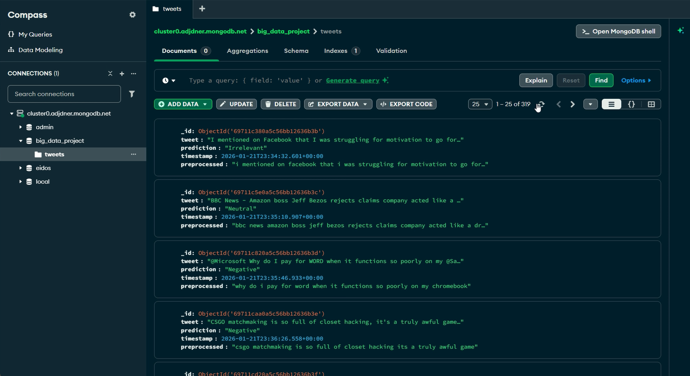
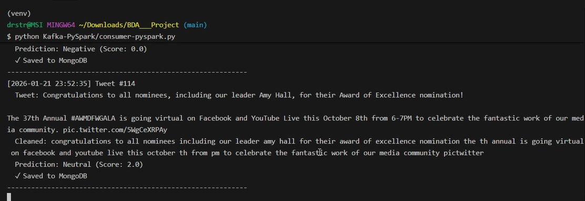

<p align="center">
  
</p>

<h1 align="center">🐦 Real-Time Twitter Sentiment Analysis</h1>

<p align="center">
  <b>A Big Data Pipeline using Apache Kafka, PySpark ML, MongoDB & Django</b>
</p>

<p align="center">
  
  
  
  
  
  
</p>

---

## 📑 Table of Contents

- [Overview](#-overview)
- [Features](#-features)
- [Architecture](#-architecture)
- [Technologies Used](#-technologies-used)
- [Dataset](#-dataset)
- [Repository Structure](#-repository-structure)
- [Prerequisites](#-prerequisites)
- [Installation](#-installation)
- [Running the Project](#-running-the-project)
  - [Step 1: Start Infrastructure Services](#step-1-start-infrastructure-services)
  - [Step 2: Run Kafka Producer](#step-2-run-kafka-producer)
  - [Step 3: Run PySpark Consumer](#step-3-run-pyspark-consumer)
  - [Step 4: Launch Django Dashboard](#step-4-launch-django-dashboard)
- [Dashboard Preview](#-dashboard-preview)
- [Troubleshooting](#-troubleshooting)
- [Contributing](#-contributing)
- [License](#-license)

---

## 🎯 Overview

This project implements a **real-time sentiment analysis pipeline** for Twitter data using Big Data technologies. The system ingests tweets through **Apache Kafka**, processes them with **PySpark MLlib** for sentiment classification, stores results in **MongoDB**, and visualizes insights through an interactive **Django dashboard**.

The pipeline classifies tweets into four sentiment categories:
- 🟢 **Positive**
- 🔴 **Negative**
- 🟡 **Neutral**
- ⚪ **Irrelevant**

---

## ✨ Features

| Feature | Description |
|---------|-------------|
| **Real-time Streaming** | Continuous data ingestion via Apache Kafka |
| **ML Classification** | Logistic Regression model trained with PySpark MLlib |
| **Scalable Storage** | MongoDB for persistent storage of classified tweets |
| **Interactive Dashboard** | Django-based web UI with real-time visualizations |
| **Custom Classification** | Classify any custom text through the web interface |
| **Visual Analytics** | Pie charts, bar graphs, and sentiment distribution tables |

---

## 🏗 Architecture

```
┌─────────────────────────────────────────────────────────────────────────┐
│                        DATA PIPELINE FLOW                               │
└─────────────────────────────────────────────────────────────────────────┘

  ╔══════════════════╗     ╔══════════════════╗     ╔══════════════════╗
  ║  📊 CSV Dataset  ║ ──► ║  📨 Kafka Topic  ║ ──► ║  ⚡ PySpark ML   ║
  ║  (Twitter Data)  ║     ║   (numtest)      ║     ║  (Classification)║
  ╚══════════════════╝     ╚══════════════════╝     ╚══════════════════╝
                                                            │
                                                            ▼
  ╔══════════════════╗     ╔══════════════════╗     ╔══════════════════╗
  ║  🌐 Web Browser  ║ ◄── ║  🖥 Django App   ║ ◄── ║  🗄 MongoDB      ║
  ║  (Dashboard)     ║     ║  (Visualization) ║     ║  (Storage)       ║
  ╚══════════════════╝     ╚══════════════════╝     ╚══════════════════╝
```

---

## 🛠 Technologies Used

| Technology | Purpose |
|------------|---------|
| **Apache Kafka** | Real-time data streaming & message queuing |
| **Apache Spark (PySpark)** | Distributed ML processing & stream analytics |
| **MongoDB** | NoSQL database for storing classified tweets |
| **Django** | Web framework for dashboard & REST API |
| **Chart.js & Matplotlib** | Data visualization |
| **Docker** | Containerized deployment of Kafka & Zookeeper |

---

## 📊 Dataset

The project uses the **Twitter Entity Sentiment Analysis** dataset from Kaggle.

| File | Description | Size |
|------|-------------|------|
| `twitter_training.csv` | Training data (74,682 tweets) | ~10 MB |
| `twitter_validation.csv` | Validation data (998 tweets) | ~165 KB |

**Data Features:**
- **Tweet ID**: Unique identifier (int)
- **Entity**: Topic/Entity mentioned (string)
- **Sentiment**: Target label - Positive/Negative/Neutral/Irrelevant (string)
- **Tweet Content**: The actual tweet text (string)

📎 **Source**: [Kaggle - Twitter Entity Sentiment Analysis](https://www.kaggle.com/datasets/jp797498e/twitter-entity-sentiment-analysis)

---

## 📁 Repository Structure

```
BDA___Project/
│
├── 📂 Django-Dashboard/          # Django Web Application
│   ├── BigDataProject/           # Django project settings
│   ├── dashboard/                # Main dashboard app
│   │   ├── views.py              # View controllers
│   │   ├── urls.py               # URL routing
│   │   └── consumer_user.py      # Custom text classifier
│   ├── templates/                # HTML templates
│   ├── manage.py                 # Django management script
│   └── db.sqlite3                # SQLite database
│
├── 📂 Kafka-PySpark/             # Streaming Pipeline
│   ├── producer-validation-tweets.py    # Kafka producer
│   ├── consumer-pyspark.py              # PySpark consumer
│   ├── logistic_regression_model.pkl/   # Trained ML model
│   └── twitter_validation.csv           # Validation dataset
│
├── 📂 ML PySpark Model/          # Machine Learning
│   ├── Big_Data.ipynb            # Jupyter notebook for training
│   ├── twitter_training.csv      # Training dataset
│   └── logistic_regression_model.pkl/   # Trained model
│
├── 📂 imgs/                      # Project images
│
├── 📄 requirements.txt           # Python dependencies
├── 📄 zk-single-kafka-single.yml # Docker compose for Kafka
├── 📄 verify_setup.py            # Setup verification script
└── 📄 README.md                  # This file
```

---

## 📋 Prerequisites

Ensure you have the following installed:

| Requirement | Version | Installation |
|-------------|---------|--------------|
| **Python** | 3.x | [python.org](https://www.python.org/) |
| **Java JDK** | 17+ | [Oracle JDK](https://www.oracle.com/java/) |
| **Docker Desktop** | Latest | [docker.com](https://www.docker.com/) |
| **MongoDB** | Latest | [mongodb.com](https://www.mongodb.com/) |
| **Git** | Latest | [git-scm.com](https://git-scm.com/) |

---

## 🚀 Installation

### 1. Clone the Repository

```bash
git clone https://github.com/drisskhattabi6/Real-Time-Twitter-Sentiment-Analysis.git
cd Real-Time-Twitter-Sentiment-Analysis
```

### 2. Create Virtual Environment

```bash
# Windows
python -m venv venv
.\venv\Scripts\activate

# Linux/Mac
python3 -m venv venv
source venv/bin/activate
```

### 3. Install Python Dependencies

```bash
pip install --upgrade pip
pip install -r requirements.txt
```

### 4. Verify Installation

```bash
python verify_setup.py
```

**Expected Output:** All items should show ✓

---

## ▶️ Running the Project

> ⚠️ **Important**: You need **4 terminal windows** to run the complete pipeline.

### Step 1: Start Infrastructure Services

**Terminal 1 - Start Kafka & Zookeeper (Docker)**

```bash
docker-compose -f zk-single-kafka-single.yml up -d
```

**Start MongoDB:**
```bash
# Windows (MongoDB as service)
net start MongoDB

# Linux
sudo systemctl start mongod
```

**Create Kafka Topic (inside Kafka container):**
```bash
docker exec -it <kafka-container-id> /bin/bash
kafka-topics --create --topic twitter --bootstrap-server localhost:9092
```

---

### Step 2: Run Kafka Producer

**Terminal 2:**
```bash
cd Kafka-PySpark
python producer-validation-tweets.py
```

**Expected Output:**
```
Produced: [Tweet content...]
Produced: [Tweet content...]
```

---

### Step 3: Run PySpark Consumer

**Terminal 3:**
```bash
cd Kafka-PySpark
python consumer-pyspark.py
```

**Expected Output:**
```
[Spark] ✓ SparkSession created successfully
[Model] ✓ Loaded ML model
[MongoDB] ✓ Connected successfully
[Kafka] ✓ Connected to Kafka consumer
[INFO] Starting to consume tweets...
============================================================
[2026-01-21 10:30:45] Tweet #1
  Tweet: I love this product!
  Prediction: Positive
  ✓ Saved to MongoDB
------------------------------------------------------------
```

---

### Step 4: Launch Django Dashboard

**Terminal 4:**
```bash
cd Django-Dashboard
python manage.py collectstatic --noinput
python manage.py runserver
```

**Access the Dashboard:**
- 🌐 **Dashboard**: http://127.0.0.1:8000/
- 🔤 **Custom Classifier**: http://127.0.0.1:8000/classify

---

## 📸 Dashboard Preview

| Dashboard Overview | MongoDB Data View |
|:------------------:|:-----------------:|
|  |  |

| Running Consumer | Sentiment Chart |
|:----------------:|:---------------:|
|  |  |

---

## 🔧 Troubleshooting

<details>
<summary><b>🔴 PySpark SparkSession Error</b></summary>

**Error:** `Constructor org.apache.spark.sql.SparkSession does not exist`

**Solution:**
```bash
pip uninstall pyspark py4j -y
pip install pyspark==3.4.3 py4j==0.10.9.7
```
</details>

<details>
<summary><b>🔴 Kafka Connection Refused</b></summary>

**Solution:**
```bash
# Check if Kafka container is running
docker ps

# Restart Kafka
docker-compose -f zk-single-kafka-single.yml down
docker-compose -f zk-single-kafka-single.yml up -d
```
</details>

<details>
<summary><b>🔴 MongoDB Connection Failed</b></summary>

**Solution:**
1. Ensure MongoDB is running
2. Check connection string in `consumer-pyspark.py`
3. Whitelist IP address if using MongoDB Atlas
</details>

<details>
<summary><b>🔴 Model File Not Found</b></summary>

**Solution:**
1. Open `ML PySpark Model/Big_Data.ipynb` in Jupyter
2. Run all cells to train the model
3. Ensure model is saved to `Kafka-PySpark/logistic_regression_model.pkl/`
</details>

---

## 🤝 Contributing

Contributions are welcome! Please feel free to submit a Pull Request.

1. Fork the repository
2. Create your feature branch (`git checkout -b feature/AmazingFeature`)
3. Commit your changes (`git commit -m 'Add some AmazingFeature'`)
4. Push to the branch (`git push origin feature/AmazingFeature`)
5. Open a Pull Request

---

## 📄 License

This project is open source and available under the [MIT License](LICENSE).

---

<p align="center">
  <b>⭐ If you found this project helpful, please give it a star!</b>
</p>

<p align="center">
  Made with ❤️ for Big Data Analysis
</p>
